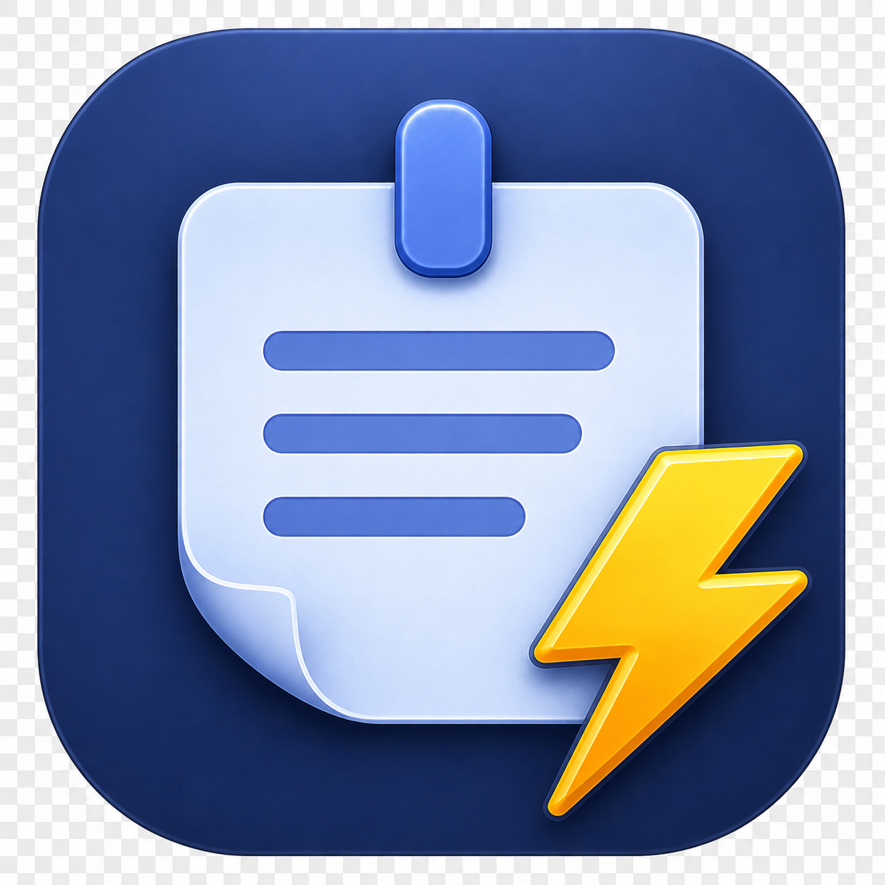

  

<h1 align="center">QuickNotes</h1>

  A macOS menu bar app for jotting things down without cluttering your desktop. 
  One click gives you a list of quick notes, right there next to the clock — no accounts, no sync, no clutter.

  
  
  
  

  

  

---

## Why QuickNotes

Post-it notes on your monitor bezel work, right up until you have more than three of them. QuickNotes is the same idea — fast, disposable, always at hand — without the sticky residue or the desktop full of tiny windows.

Everything lives in your menu bar. Click the icon, see your notes, jot one down, close it. Notes are stored locally as plain files — no account, no sync, no cloud service reading your grocery list.

---

## Features

### 📝 Notes
- Split view: a list on the left, the selected note on the right
- A note's title is just its first line — no separate naming step
- **⌘N** creates a note and focuses the editor immediately
- **Paste Clipboard as New Note** — from the toolbar, or right-click the menu bar icon to do it without even opening the popover
- **Copy** the current note straight to the clipboard
- Search notes by title or content, with a one-click × to clear
- **Color labels** — six sticky-note colors for quick visual scanning
- **Pin** a note to keep it at the top of the list
- Relative timestamps ("Just now", "12 minutes ago")
- **Clickable links** — URLs and dropped file paths are detected automatically; click to open
- **Drag a file or folder** into a note to drop in its path

### 🔒 Locking - Encrypted Notes
- Lock any individual note with its own passcode — content is encrypted with AES-GCM, key derived with PBKDF2
- Nothing password-related is stored by default — a wrong passcode simply fails to decrypt, nothing to leak
- Optional **Touch ID** unlock, backed by a passcode saved in the Keychain behind biometrics (the typed passcode still works as a fallback)
- Configurable **auto re-lock**: Immediate, 2/5/10 minutes, or until QuickNotes quits
- Optional first-line preview for locked notes in the list (off by default — locked notes show a generic label unless you turn this on)
- Clear warnings when locking a note: there's no passcode recovery, and any linked files are *not* themselves encrypted — only the note's text is

### ⚙️ Settings

| Setting | Default |
|---|---|
| Launch at Login | Off |
| Open QuickNotes with ⌥N from anywhere | On |
| Note Text Size | Medium *(Small / Medium / Large)* |
| Show Note Preview While Locked | Off |
| Auto Re-lock Unlocked Notes | Immediate *(2 / 5 / 10 min / Until app quits)* |
| Unlock Notes with Touch ID | Off *(only shown on Macs with Touch ID)* |

A "?" button in Settings lists all keyboard shortcuts.

---

## Storage & Privacy

Notes are stored as plain JSON files in `~/Library/Application Support/QuickNotes/` — one file per note, nothing else. No iCloud, no analytics, no network requests of any kind. **Show Notes in Finder…** in Settings opens that folder directly.

---

## Requirements

- macOS 14 (Sonoma) or later
- Apple Silicon or Intel Mac

---

## Download

**[⬇ Download QuickNotes v1.0](https://github.com/BrianB-22/quicknotes/releases/latest)**

1. Download the DMG and open it
2. Drag **QuickNotes** into the **Applications** shortcut in the same window
3. Launch QuickNotes from Applications (or Spotlight) — look for its icon in the menu bar

This build is signed and notarized by Apple — no security warnings, no exceptions needed.

## Building from Source

> **Note:** The source code in this repository may include work-in-progress features or changes ahead of the latest release. The DMG in [Releases](https://github.com/BrianB-22/quicknotes/releases) is the stable, signed build — source and releases may not always be in sync.

1. Clone the repo
2. Open `QuickNotes.xcodeproj` in Xcode
3. Select the **QuickNotes** scheme
4. Build and run — `⌘R`

No external dependencies. No Swift packages to resolve.

---

## About

QuickNotes — part of the same "quick" menu bar app family as [QuickCal](https://github.com/BrianB-22/quickcal).

Interested in other handy utilities like this? Check out [bernacki.me](https://bernacki.me).
