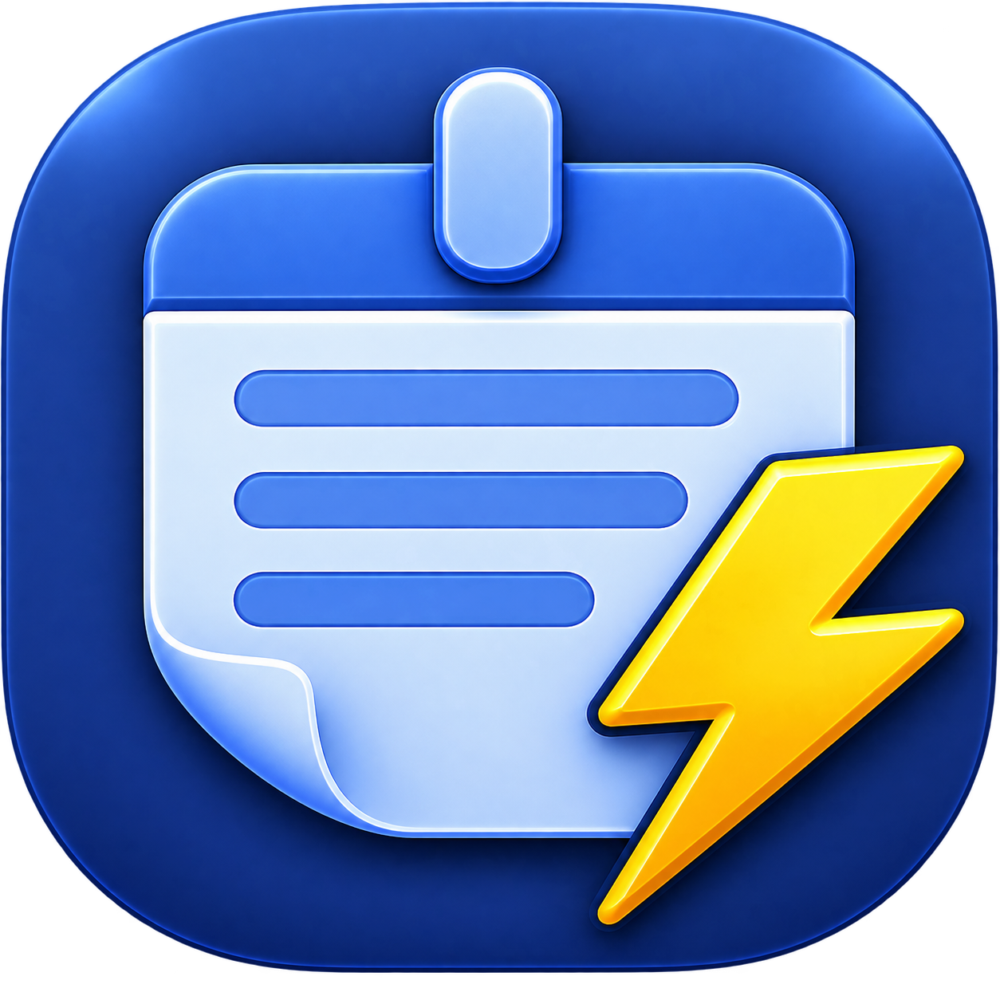
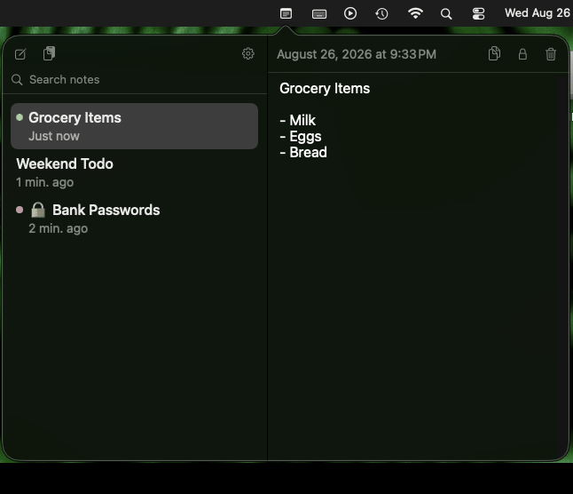

  

<h1 align="center">QuickNotes</h1>

  A macOS menu bar app for jotting things down without cluttering your desktop. 
  One click gives you a list of quick notes, right there next to the clock — no accounts, no sync, no clutter.

  
  
  
  

  

  

---

## Why QuickNotes

Post-it notes on your monitor bezel work, right up until you have more than three of them. QuickNotes is the same idea — fast, disposable, always at hand — without the sticky residue or the desktop full of tiny windows.

Everything lives in your menu bar. Click the icon, see your notes, jot one down, close it. Notes are stored locally as plain files — no account, no sync, no cloud service reading your grocery list.

---

## Features

A one-time welcome prompt on first launch points you to Settings and offers to turn on Launch at Login — shown once, ever, regardless of which you choose.

### 📝 Notes
- Split view: a list on the left, the selected note on the right
- A note's title is just its first line — no separate naming step
- **⌘N** creates a note and focuses the editor immediately
- **Paste Clipboard as New Note** — from the toolbar, right-click the menu bar icon, or a dedicated user-recordable hotkey (off by default) to do it from anywhere with zero clicks
- **Copy** the current note straight to the clipboard
- Search notes by title or content, with a one-click × to clear
- **Color labels** — six sticky-note colors for quick visual scanning
- **Pin** a note to keep it at the top of the list
- Relative timestamps ("Just now", "12 minutes ago")
- **Clickable links** — URLs and dropped file paths are detected automatically; click to open
- **Drag a file or folder** into a note to drop in its path
- **Save Note As…** — export the current note to a `.txt` or `.md` file anywhere on disk
- **Markdown preview** — flip a note between plain Text and a rendered MD view (TXT/MD toggle below the editor); in Text mode, a small toolbar inserts Bold/Italic/Code/Heading/Bulleted List/Checklist/Link syntax at the cursor
- **Tappable checklists in MD mode** — `- [ ] task` lines render as checkboxes you can click to check off, the one interactive thing in an otherwise read-only preview; the change is a normal edit under the hood, so it plays nicely with locked notes and version history
- **Version History** — on by default. Each time you leave a note you've edited (switch away, or close the popover), its previous text is saved so you can recover it later if you accidentally wipe something out. Right-click a note → **Version History…** for a read-only timeline you can scroll through and copy text from (last 30 versions per note) — the note's current text is always listed first, tagged **(Current)**, so it's easy to compare against any past version below it. Not automatic restore — you copy what you need and paste it back in yourself. **Locked notes are excluded**: history is only ever kept for a currently-plain note, and locking a note clears any history it had, so a note you've locked never leaves a plaintext trail elsewhere in its file.
- **Deleting a note moves it to the macOS Trash** by default, not gone-forever — a confirmation shows the note's name and filename, and it's a normal Finder recovery from there (copy it back into the Notes folder, findable via Settings → Show Notes in Finder…) if you delete the wrong one. Turn off "Move deleted notes to the Trash" in Settings to make deleting immediate and permanent instead.
- **Pop out into a window** — a toolbar button detaches the note list/editor from the menu bar popover into a real, resizable window for comfortable side-by-side editing. Clicking the menu bar icon again always closes the window and reopens the familiar popover right there — a guaranteed way back even if the window gets lost behind other windows, minimized, or pushed to another Space, since it's the same notes and selection either way.

### 🔒 Locking - Encrypted Notes
- Lock any individual note with its own passcode — content is encrypted with AES-GCM, key derived with PBKDF2
- Nothing password-related is stored by default — a wrong passcode simply fails to decrypt, nothing to leak
- Configurable **auto re-lock**: Immediate, 2/5/10 minutes, or until QuickNotes quits
- **Remove Lock…** — right-click a locked note to permanently decrypt it back into a normal note, after verifying the passcode
- Optional first-line preview for locked notes in the list (off by default — locked notes show a generic label unless you turn this on)
- Warning on Passwords: there's no passcode recovery, and any linked files are *not* themselves encrypted — only the note's text is

### ⚙️ Settings

| Setting | Default |
|---|---|
| Launch at Login | Off |
| Open QuickNotes with a hotkey | Off, defaults to ⌥N when enabled *(fully user-recordable)* |
| Open the pop-out window with a hotkey | Off *(user-recordable, independent of the one above)* |
| Paste clipboard as a new note with a hotkey | Off *(user-recordable, independent of the others)* |
| Text Size | Medium *(Small / Medium / Large)* |
| Show Titles for Locked Notes | Off |
| Auto Re-lock Unlocked Notes | Immediate *(2 / 5 / 10 min / Until app quits)* |
| Keep Version History | On |
| Move Deleted Notes to the Trash | On |
| Check for New Versions | On |

A "?" button in Settings lists all keyboard shortcuts.

---

## Storage & Privacy

Notes are stored as plain JSON files in `~/Library/Application Support/QuickNotes/` — one file per note, nothing else. No iCloud, no analytics, no accounts. **Show Notes in Finder…** in Settings opens that folder directly.

*Note: If "Check for new versions" is enabled in Settings (on by default), QuickNotes checks GitHub's release API on launch to see if a newer version exists — the only network call the app makes, and it never sends anything about you or your notes.*

See [SECURITY.md](SECURITY.md) for a full breakdown (dependencies, entitlements, network behavior, encryption) — useful if you need to get this approved for use at work. Secret scanning, Dependabot alerts, CodeQL code scanning, and private vulnerability reporting are all enabled on this repo — see the live [security dashboard](https://github.com/BrianB-22/quicknotes/security).

---

## Requirements

- macOS 14 (Sonoma) or later
- Apple Silicon or Intel Mac

---

## Download

**[⬇ Download QuickNotes v1.6](https://github.com/BrianB-22/quicknotes/releases/latest)**

1. Download the DMG and open it
2. Drag **QuickNotes** into the **Applications** shortcut in the same window
3. Launch QuickNotes from Applications (or Spotlight) — look for its icon in the menu bar

This build is signed and notarized by Apple — no security warnings, no exceptions needed.

## Building from Source

> **Note:** The source code in this repository may include work-in-progress features or changes ahead of the latest release. The DMG in [Releases](https://github.com/BrianB-22/quicknotes/releases) is the stable, signed build — source and releases may not always be in sync.

1. Clone the repo
2. Open `QuickNotes.xcodeproj` in Xcode
3. Select the **QuickNotes** scheme
4. Build and run — `⌘R`

No external dependencies. No Swift packages to resolve.

---

## About

Check out my other handy "Quick" menu bar tools, like [QuickCal](https://github.com/BrianB-22/quickcal).

Interested in other handy utilities like this? Check out [bernacki.me](https://bernacki.me).

---

This software is provided "as is", without warranty of any kind, express or implied, including but not limited to the warranties of merchantability, fitness for a particular purpose, and noninfringement. Use at your own risk.
